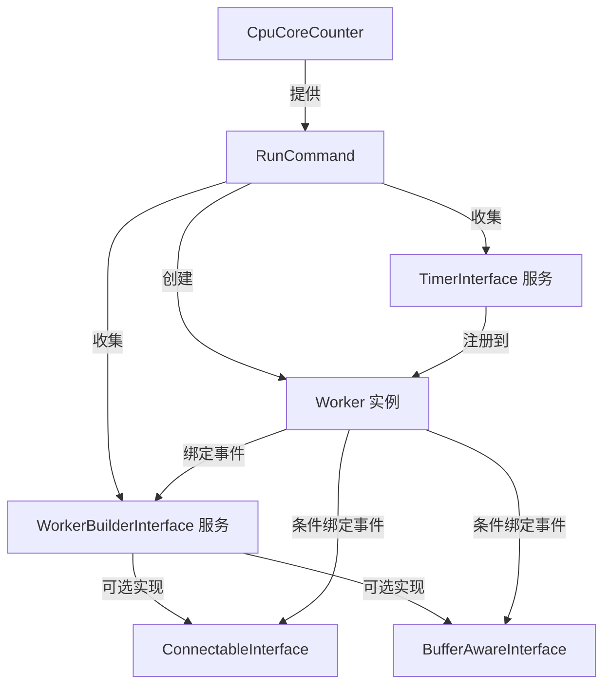

# Workerman模块

## 核心功能与技术原理

WorkermanBundle 是基于 [Workerman](https://www.workerman.net/) 的 Symfony 集成模块，提供了在 Symfony 应用中使用 Workerman 高性能异步网络通信框架的能力。该模块通过抽象接口和服务标签系统，实现了 Workerman 与 Symfony 依赖注入容器的无缝集成。

核心功能包括：

- 提供基于命令行的 Workerman 服务启动机制
- 自动发现并注册实现了特定接口的 Worker 服务
- 支持 TCP/UDP 等多种网络协议的服务端实现
- 提供缓冲区管理机制
- 集成 Crontab 定时任务系统
- 自动根据 CPU 核心数优化 Worker 进程数量

## 架构设计与关键类

### 核心接口

Bundle 通过四个核心接口定义了 Workerman 服务的行为规范：

1. **WorkerBuilderInterface**：Worker 服务的基础接口，定义了 Worker 的生命周期事件处理方法
   - `getName()`: 定义服务标识
   - `onWorkerStart()`: Worker 启动时的初始化逻辑
   - `onWorkerStop()`: Worker 停止时的清理逻辑
   - `onWorkerReload()`: Worker 重载时的处理逻辑

2. **ConnectableInterface**：可连接的 Worker 服务接口，定义了网络连接相关的事件处理方法
   - `getTransport()`: 指定传输协议（tcp/udp）
   - `getProtocolClass()`: 自定义协议处理类
   - `getListenIp()/getListenPort()`: 监听配置
   - 连接生命周期事件：`onConnect/onClose/onMessage/onError`

3. **BufferAwareInterface**：缓冲区感知接口，定义了缓冲区管理相关的事件处理方法
   - `onBufferFull()`: 发送缓冲区满时的处理
   - `onBufferDrain()`: 发送缓冲区清空时的处理

4. **TimerInterface**：定时任务接口，基于 workerman/crontab 实现
   - `getExpression()`: 定义 Cron 表达式
   - `execute()`: 定时执行的任务逻辑

### 命令行组件

`RunCommand` 类是模块的核心执行入口，负责：

- 收集所有标记为 `workerman.worker` 的服务
- 收集并注册所有 `workerman.timer` 定时任务
- 根据服务实现的接口类型配置 Worker 实例
- 设置 Worker 进程数量为 CPU 核心数
- 配置 PID 文件和日志文件路径
- 启动 Workerman 服务

## 组件交互关系

## 扩展机制

Bundle 采用标签自动配置机制实现扩展：

1. 实现 `WorkerBuilderInterface` 的服务会自动被标记为 `workerman.worker`
2. 实现 `ConnectableInterface` 的服务会自动被标记为 `workerman.connectable`
3. 实现 `BufferAwareInterface` 的服务会自动被标记为 `workerman.buffer-aware`
4. 实现 `TimerInterface` 的服务会自动被标记为 `workerman.timer`

开发者只需实现相应接口，服务会被自动发现并集成到 Workerman 运行时中。

## 依赖关系

- 核心依赖：
  - `workerman/workerman`: 提供底层网络通信框架
  - `workerman/crontab`: 提供定时任务支持
- 辅助依赖：
  - `fidry/cpu-core-counter`: 用于检测系统 CPU 核心数
  - `phpinnacle/buffer`: 提供高效的二进制数据缓冲区处理

## 技术限制与注意事项

- Workerman 要求 PHP 运行在 CLI 模式下
- 在生产环境中，应使用 daemon 模式运行服务
- 由于 Workerman 采用多进程模型，需注意：
  - 共享资源的并发访问问题
  - 定时任务在每个 Worker 进程中都会执行
  - 服务实现类应避免保存状态，或确保状态在多进程环境下的一致性
- 在高并发场景下：
  - 应关注缓冲区管理以避免内存溢出
  - 合理设置 Worker 进程数，避免过多进程导致系统资源耗尽
  - 对于 CPU 密集型任务，建议保持 Worker 数量等于 CPU 核心数
  - 对于 IO 密集型任务，可适当增加 Worker 数量
